Recebemos para este desfio uma base de dados em json, começamos importando a biblioteca pandas que vamos usar nesta limpeza
e na sequência importamos a base de dados que vamos usar

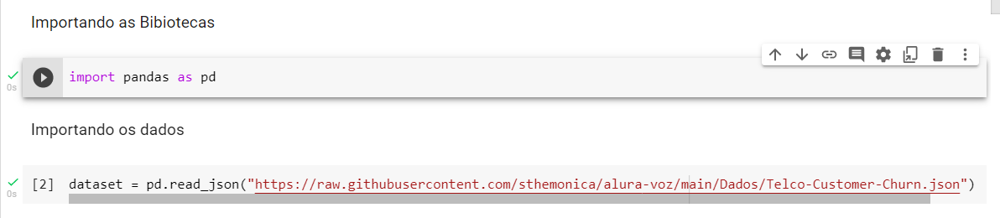

Abaixo podemos ver o estado inicial do arquivo, ele continha diversos níveis de dicionários com especificações dos dados de cada coluna, primeiramente precisavamos desenpacotar estas informações

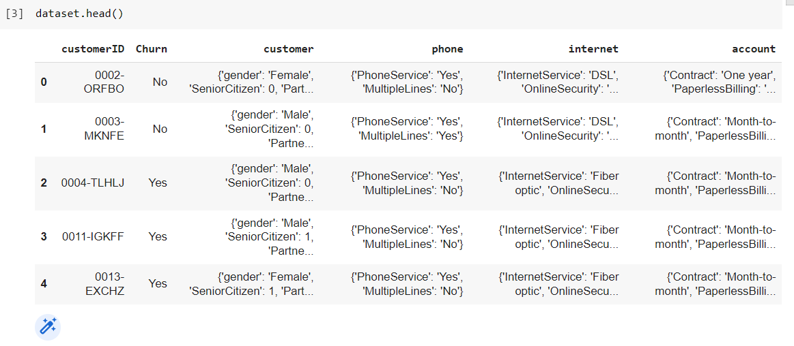

usando o método nomalize, podemos desempacotar as informações e exporta-las em colunas individuais, como podemos ver na imagem abaixo, o mesmo método foi aplicado em todas as colunas que possuiam esta mesma característica.

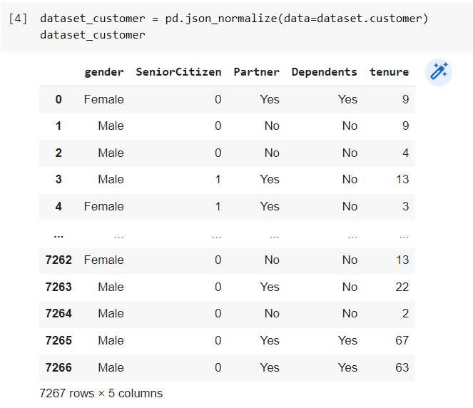
depois cada parte desenpacotada foi adicionada a base principal e as colunas mãe forma excluidas, ficando com um apécto melhor como podemos observar na imagem abaixo.

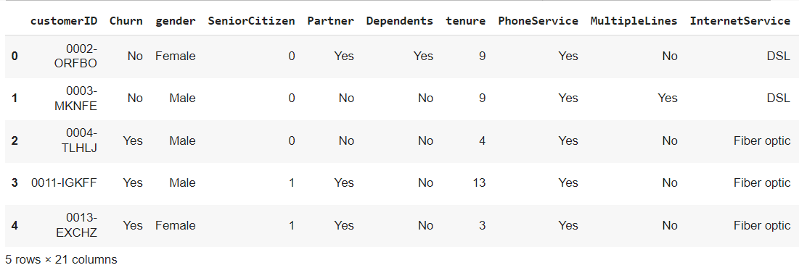
Começamos a etapa de procurar por inconsitêcnias de dados, não localizamos valores vazios, tipo NaN ou Null.
depois verificamos que tinhamos ao invez de valores vazios ' ' simplesmente um espaço como valor. como podemos ver na imagem abaixo.

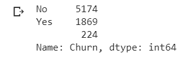
 
 continuamos verificando valores e na coluna Senior, encontramos 0 e 1 ao invez de yes e no então corrigimos padronizando a base.

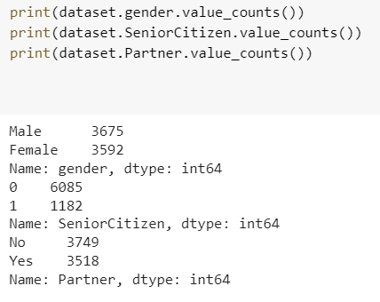

 fizemos algumas checagens para verificar nas colunas com valores numéricos valores descrepantes ou negativos.
 mas não encontramos valores deste tipo.

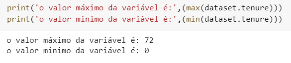

checamos qual o percentual do valor nulo, como o cliente informou que essa seria a variável alvo optamos por excluir as linhas pois elas representavam apenas perto de 3%

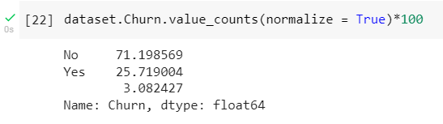

verificamos que uma das variáveis numéricas estava com os valores armazenados como texto e convertemos o tipo para sanar esta inconsistência

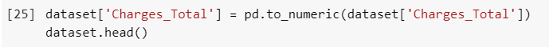

realizamos a tradução dos rótulos das colunas

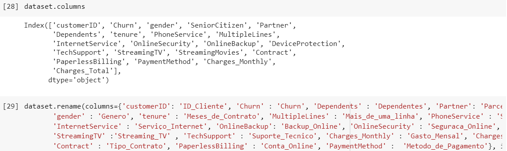

depois criamos a varíavel de gasto diário

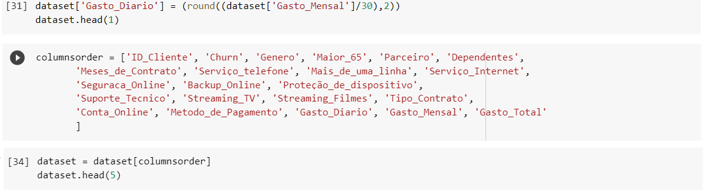

reordenadmos as colunas para que ficasse com a gradação gasto diario, mensal, total,
depois exportamos a base para ser usada futuramente.
