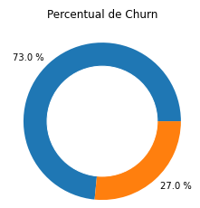
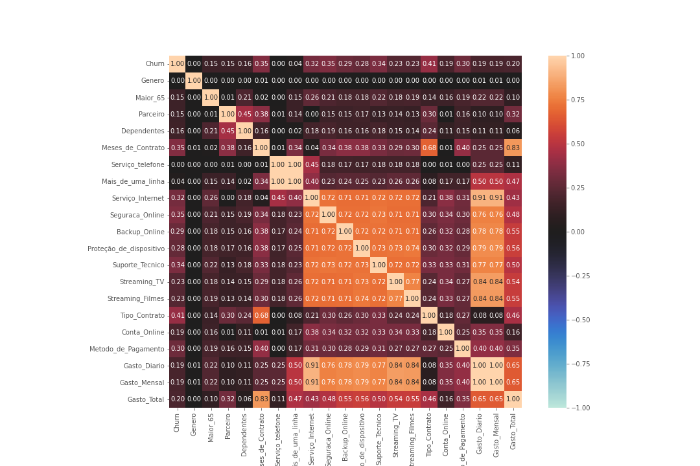
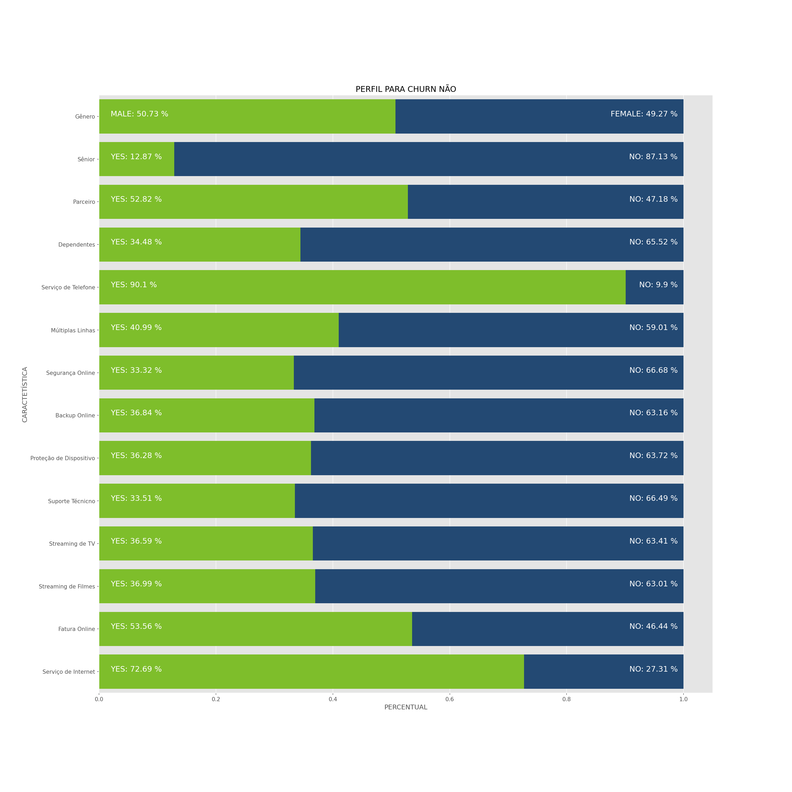
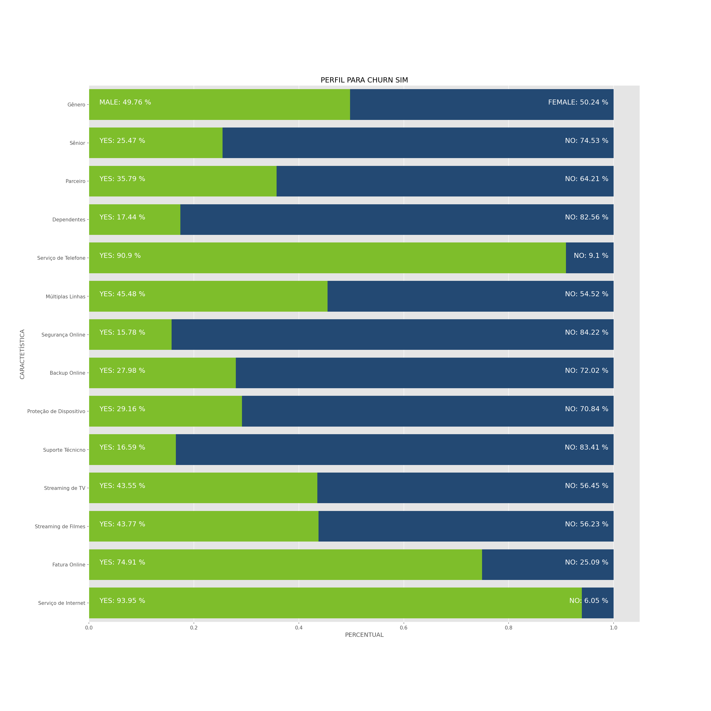

# Desafio Alura Data Science Semana 2 Análise Exploratória dos Dados

Plotagem de gráficos para melhor entendimento da correlação entre as demais variáveis e nossa variável alvo.
 
## Tecnologia

O software  usado neste projeto foi:

* Python version  3.9.5

## Serviços Usados

* Github
* Google Colab

## Bibliotecas Python

* Pandas
* Seaborn
* Matplotlib
* Dython

## Como foi feito

Será descrito abaixo através de textos e imagens.

Após importar os dados vamos plotar a distribuição de nossas variáveis. Assim, vamos plotar a distribuição da variável alvo.

Há um desbalanceamento das variáveis assim seria possível utilizar metodologias como, UNDERSAMPLING,  OVERRSAMPLING ou SMOTE, mas optamos por manter a base adotar medidas para minimizar o desbalanceamento apenas em projetos futuros. Este projeto é apenas para criação de um modelo inicial. Mas devemos ficar atentos pois existe esta possibilidade de melhoria de modelo.
 
Após definir uma função simples para plotar os dados para visualizarmos o comportamento de algumas variáveis, começamos a plotar nossas variáveis.
Nesta variável abaixo o gráfico é muito similar assim ela parece ter pouca correlação, o que seria surpreendente até certo ponto, pois o cliente sênior tende a ter um padrão de consumo diferente, mas isso não influência sua permanência ou não na empresa.
 

Esta variável possui algum grau de correlação, e o mais surpreendente mostra uma tendência de que a empresa está perdendo clientes novos, vemos um pico claro de abandono da empresa na maior parte pelo grupo com 0 a 5 meses de contrato, mas parece ser mais fácil reter clientes depois de um certo período de contrato.

Vimos para esta variável uma proporção diferente dos gráficos o que pode indicar algum grau de correlação, os grupos mais fiéis são os que gastam menos pois temos um pico de abandono da empresa por cliente na faixa de 80 a 100 reais de gasto mensal.
 

Vamos gerar um gráfico de mapa de calor para verificar qual grau de correlação entre todas as variáveis.

 
Agora vamos relacionar quais variáveis possuem mais correlação: gênero não possui nenhuma correlação com o abandono de clientes. Dependentes, parceiro, sênior, ter ou não telefone não parecem influenciar em nada.
Mas ter internet, e seus serviços associados são fatores que apresentam entre 28 a 34 por centro de correlação. A variável com mais correlação é o tipo de contrato.

 
 Vamos agora analisar os perfis de clientes com churn sim e não de forma agrupada para verificar como estes perfis são diferentes.
 

Comparando variável a variável temos alguns pontos que chamam a atenção. Vimos que a variável serviço de telefone e múltiplas linhas parece ser muito similar nos dois gráficos. Os serviços ligados a internet parecem ser onde temos mais diferença os clientes que contratam suporte técnico são o dobro praticamente comparando churn sim e não sendo em maior número para a os clientes fiéis. Os serviços de streaming de um modo geral são ligeiramente maiores entre os clientes que abandonam a empresa. Idosos tendem a abandonar a empresa. Pessoas com parceiro e filhos tendem a permanecer.
 

Vamos gerar o gráfico comparativo para a nova variável e para a variável tipo de contrato que possui maior correlação. Ao visualizar o gráfico podemos ver a influência da variável alvo no variável plotada.

Visualizando os dados podemos inferir:

Que um dos pontos que mais contribui para a diminuição do churn é o tipo de contrato contratos com fidelidade geram um abandono menor que contratos sem fidelidade, pessoas com gasto mensal baixo tendem a permanecer na empresa. Porém um fator que merece atenção é no caso de clientes sem internet os clientes sem internet parecem mais fiéis comparando os gráficos, mas o fato de quase toda a gama de serviços oferecidos ser dependente de internet, levanta a preocupação que este cliente fiel possa desaparecer com o tempo. Os serviços de suporte e backup e correlatos estão mais presentes nos clientes que permanecem na empresa, assim estes serviços parecem estar sendo bem recebidos pelos usuários e agregando valor a percepção do cliente.

## Recursos Usados

  - Importação de Database
  - Criação de função de plotagem e salvamento de gráficos em imagens
  - Plotagem e análise de gráfico
  

## Links

  - Repositório: https://github.com/Alexandremsn/desafio_alura_data_science/
  - Se for encontrado um bug, favor entrar em contato alexandremsneto1986@gmail.com

## Versioning

1.0.0.0

## Autor

* **Alexandre Machado da Silva Neto**: @alexandremsn (https://github.com/alexandremsn)
