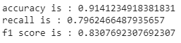

# Desafio Alura Data Science Semana 3 criação de um modelo preditivo

 
Criação de um modelo preditivo, teste, aplicação de métricas e ajuste de hiperparâmetros.

## Tecnologia

O software  usado neste projeto foi:

* Python version  3.9.5

## Serviços Usados

* Github
* Google Colab
 

## Bibliotecas Python

* Pandas
* Numpy
* sklearn.model_selection
* sklearn.neighbors
* catboost
* sklearn.ensemble
* sklearn.metrics
 

## Como foi feito

Será descrito abaixo através de textos e imagens.

Realizamos a importação de dados, verificamos que as variáveis estavam com sim e não assim, transformamos em variáveis binárias de zero e um.

Depois da transformação ficamos com este resultado.

Criamos variáveis dummies para as variáveis categóricas com mais de duas opções, ficando assim com este resultado.

 
Assim ficamos com 28 variáveis conforme abaixo.

 
Criamos uma função para avaliar os modelos, depois testamos a função no nosso primeiro modelo, NearestNeighbors.
 
 

 
Implementamos uma grade de parâmetros para melhorar os hiperparâmetros.

Assim tivemos uma melhora em nosso modelo.

Implementamos dois modelos um de random forest e outro de boost, tivemos uma melhora significativa.

Para o modelo de boost obtivemos um resultado ligeiramente melhor. 

Agora vamos criar uma variável de erro para verificar a correlação entre o erro e as variáveis para apontar quais variáveis estão prejudicando o modelo.

Apontando a correlação como medida para construir um modelo razoável, vamos selecionar as variáveis que tem correlação com o erro e dropa-las

Assim no resultado abaixo mais uma melhora.

 Agora vamos tentar uma configuração de hiperparâmetros mais computacionalmente agressiva aumentado as iterações e profundidade da árvore. 

 
 
Tivemos uma melhora ainda mais significativa, não vamos testar a grade de parâmetros devido a nossa limitação computacional. Mas temos um modelo razoável para realizar previsões. Para o futuro poderíamos testar mais combinações de variáveis, verificar como podemos criar variáveis significativas e assim chegar a uma previsão ainda melhor. Poderíamos aprofundar ainda mais a eda para selecionar uma combinação diferente de variáveis. Poderíamos explorar as variáveis que dropamos para verificar outlaiers para dropalos do df de treino. Bom ainda tem muitas opções a serem exploradas. 
 
 

## Recursos Usados

  - Importação de Database
  - Padronização de variáveis
  - Criação de variáveis Dummies
  - Criação de um modelo de KNN
  - Criação de um modelo de Random Forest
  - Criação de um modelo de boost
  - Implementação de uma grade de parâmetros para teste dos modelos
  - Criação de uma variável de erro
  - Ajuste de Hiperprâmetros
  

## Links

  - Repositório: https://github.com/Alexandremsn/desafio_alura_data_science/
  - Se for encontrado um bug, favor entrar em contato alexandremsneto1986@gmail.com

## Versioning

1.0.0.0

## Autor

* **Alexandre Machado da Silva Neto**: @alexandremsn (https://github.com/alexandremsn)

